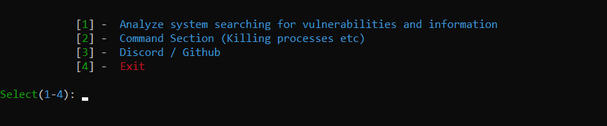
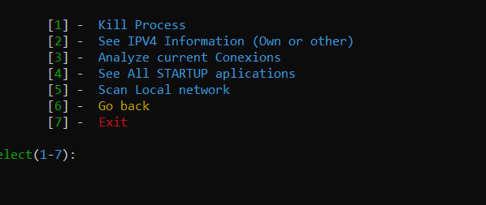
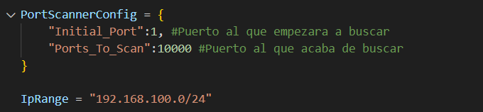

# SysInfo
A tool created To scan your System Searching for vulnerabilities, 
 

# Scan Section

Features
1-See your Own Ipv4 Information
2-Mac Addresses
3-Extract Emails
4-Extract Windows Users
5-Extract Cookies
6-See if Users have password enabled and the group that they pertain
7-See if the microphone is in use if yes show you the application
8-Try to connect to Mysql to find vulnerabilities (This step can be skipped by pressing CTRL+C)
9-Port Scanning
10-Process Scanning

# Command Section

Command Section Allows you to Kill Process by pID or Name, scan ur Network, Search for STARTUP aplications, Current Conexions, Ip Information

# Settings

Setting for Scanning Ports and scanning network

Thanks to Everybody!

# Exe
Run this .exe as Administrator